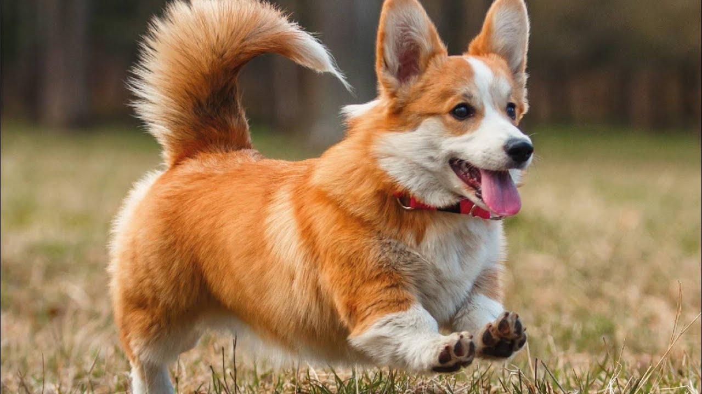

# About me

Страница About me

## Переход на страницу  [404](https://maanastasiya.github.io/site2/404)

## План рассказа о себе

План рассказа о себе может быть таким:

- Вступление: представьтесь и расскажите, почему вы решили рассказать о себе.
- Семья: расскажите о своих родителях, братьях, сёстрах и других родственниках.
- Образование: опишите, где вы учились, какие предметы вам нравились, и какие достижения у вас были.
- Работа или учёба: расскажите о своей профессии, учёбе, стажировках и опыте работы.
- Хобби и интересы: поделитесь своими увлечениями, например, спортом, музыкой, рисованием или чтением.
- Путешествия: расскажите о местах, которые вы посетили, и впечатлениях от них.
- Планы на будущее: поделитесь своими мечтами, целями и планами на будущее.
- Заключение: поблагодарите слушателей за внимание и выразите надежду на дальнейшее общение.

# Любимая порода собаки

